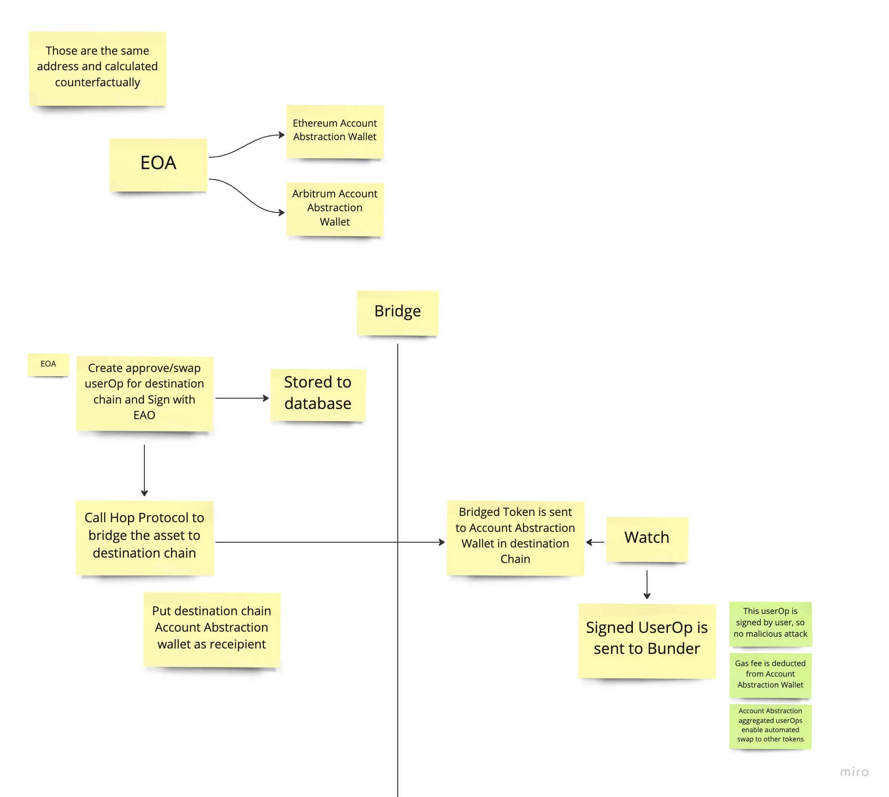

# Account Abstraction Connect

## Pitch Deck

https://docs.google.com/presentation/d/10g0g-fu50OWloK0maTYXyX4yMTOuGjWTDVE7-nEEkvc/edit#slide=id.ge77df665bb_0_14

## How it works

1. AccountAbstraction wallet factory enables to have same contract wallet address in each chain

2. Users create userOp for swapping token and send them to the original EOA in the destination chain. This is used after bridging

3. Set the AccountAbstraction wallet as the recipient when doing bridge with Hop Protocol

4. After bridging, the contract wallet is funded, and the userOp created step-2 can be sent to under

5. The fund is moved to the user's EOA in the destination chain

## Screenshot

Auto swap Bridge with Hop Protocol

## Bounties

### Hop - Bounty #2

- Integrated Account Abstraction for auto-mate swapping in the destination chain.
- Account Abstraction enables batch Tx and gas-less auto Tx for better UX for Hop.
- Hop can be the Account Abstraction gateway for users by this app.
- All the Hop-related logic is stored here
  - https://github.com/taijusanagi/accountabstraction-auto-bridge/blob/main/packages/app/src/pages/bridge.tsx#L35

### Uniswap - Bounty #3

- Integrated Uniswap V3 swap logic with Account Abstraction contract wallet.
- Account Abstraction batch Tx and gas-less auto Tx for better UX for Uniswap.
- This is a test file for explaining how it works
  - https://github.com/taijusanagi/accountabstraction-auto-bridge/blob/main/packages/contracts/test/AccountAbstractionWallet.test.ts#L179

### Quicknode - Bounty #Using QuickNode

- Integrated Quicknode RPC for deploying contracts to Arbitrum Georli Network
- Integrated Quicknode RPC for Account Abstraction bundler, which enables users to send Tx in a gas-less way, and Quicknode powerful RPC helped this bundler works properly without no running-down
- This is hard-coded in the running script
  - https://github.com/taijusanagi/accountabstraction-auto-bridge/blob/main/package.json#L18
